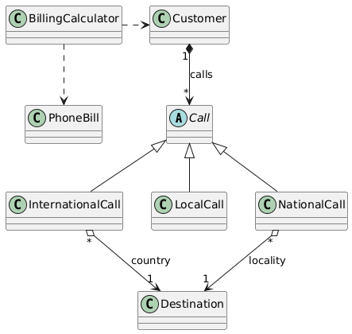

# Sistema de Facturación Telefónica

Implementación de un sistema de facturación mensual de llamadas telefónicas desarrollado en Smalltalk como resolución del ejercicio técnico propuesto.

## Objetivo

El sistema permite calcular la facturación mensual de clientes considerando:

* Abono mensual básico
* Consumo por llamadas locales
* Consumo por llamadas nacionales
* Consumo por llamadas internacionales

Cada tipo de llamada posee reglas de tarifación específicas según horario, día o destino.

---

# Requerimientos implementados

## Facturación mensual

La factura mensual está compuesta por:

* Abono fijo mensual
* Costo total de llamadas realizadas durante el período

---

## Llamadas locales

Las llamadas locales aplican distintas tarifas según día y horario:

| Condición                       | Costo por minuto |
| ------------------------------- | ---------------- |
| Días hábiles de 08:00 a 20:00   | 0,20             |
| Días hábiles fuera de ese rango | 0,10             |
| Sábados y domingos              | 0,10             |

---

## Llamadas nacionales

Las llamadas nacionales poseen una tarifa variable según la localidad destino.

---

## Llamadas internacionales

Las llamadas internacionales poseen una tarifa variable según el país destino.

---

# Decisiones de diseño

## Lenguaje

* Smalltalk

## Metodología de desarrollo

El sistema fue desarrollado utilizando TDD (Test-Driven Development).

Se definieron primero los casos de prueba y posteriormente se implementó la funcionalidad necesaria para satisfacerlos, iterando el diseño de manera incremental.

Este enfoque permitió validar el comportamiento del sistema desde el inicio y guiar el diseño hacia una estructura orientada al dominio y fácilmente testeable.

## Suposiciones

* La facturación se realiza de manera mensual.
* La duración de las llamadas se considera en minutos.
* Los datos se generan en memoria.
* No se implementa persistencia.
* No se implementa interfaz gráfica.
* La salida se muestra por consola.
* La tarifa de las llamadas locales se determina según el horario de inicio de la llamada.
* Las llamadas se facturan utilizando una única tarifa durante toda su duración.
* No se aplican cambios de tarifa durante una llamada en curso, incluso si la llamada atraviesa distintos períodos tarifarios.
* La facturación muestra el total, no discrimina por el tipo de llamada.

# Solución

## Diagrama UML



El siguiente diagrama UML representa el modelo de dominio del sistema de facturación telefónica. Se incluyen las principales entidades involucradas en el cálculo de facturas mensuales, junto con sus relaciones estructurales y jerárquicas.

La clase `Call` actúa como abstracción general para los distintos tipos de llamadas, que se especializan en `LocalCall`, `NationalCall` e `InternationalCall`. Estas subclases implementan comportamientos específicos de acuerdo al tipo de llamada.

El cliente (`Customer`) mantiene un conjunto de llamadas asociadas, lo que permite reconstruir su historial y utilizarlo como base para el cálculo de la facturación mensual.

La clase `BillingCalculator` encapsula la lógica de cálculo de la factura a partir de un cliente y un período determinado, generando como resultado una instancia de `PhoneBill`, que contiene el detalle y el total facturado.

El modelo separa claramente responsabilidades entre entidades de dominio y lógica de cálculo, manteniendo una estructura simple y extensible.

## Modelo de creación de llamadas

El `Customer` expone métodos explícitos para la creación de cada tipo de llamada (`makeLocalCall`, `makeNationalCall`, `makeInternationalCall`).

Dado el alcance acotado del ejercicio y la ausencia de requisitos de extensibilidad futura, se optó por una solución directa y explícita alineada con el enunciado, priorizando claridad del modelo por sobre mecanismos de abstracción adicionales.

Cada tipo de llamada encapsula su propia lógica de construcción mediante métodos de clase (`withDuration:`...).

La responsabilidad del `Customer` se limita a registrar llamadas, manteniendo el historial sobre el cual se realiza la facturación.

## Cómo cargar el proyecto

1. Abrir Cuis Smalltalk.
2. File In del archivo:

```
PhoneBilling.st
```


## Ejecutar tests

Abrir Test Runner y ejecutar:

```
BillingTest
CustomerTest
```


## Ejecutar demo

En Workspace ejecutar:

```
PhoneBilling run
```

El método de clase `run` devuelve un resumen de la factura de ejemplo.